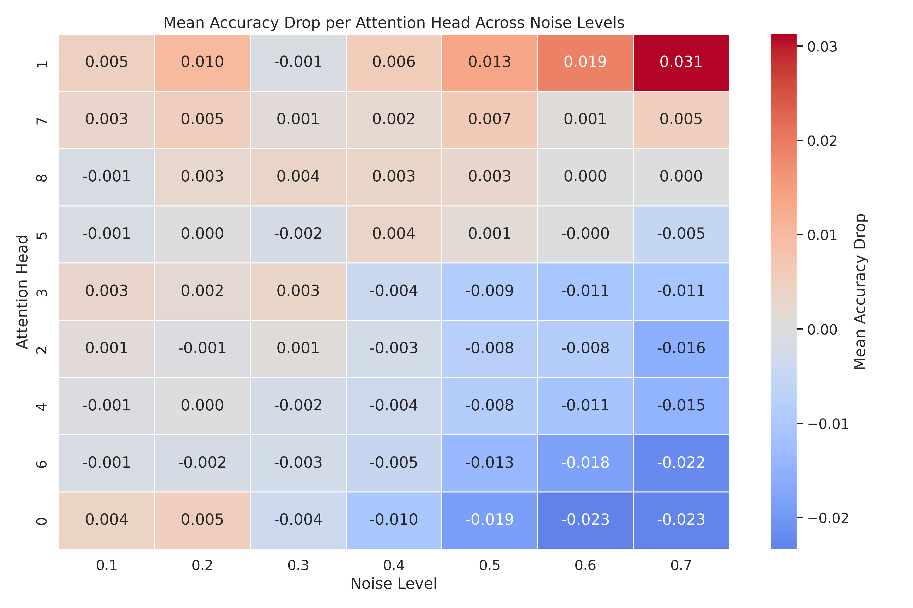

# LLM Attention Head Perturbation Analysis

This repository contains code and data for analyzing the contribution of individual attention heads in large language models (LLMs) by injecting noise into specific heads and measuring the impact on downstream performance. The experiments focus on sentiment classification using a small IMDB dataset and HuggingFace transformer models.

## Repository Structure

- **main.py**: Main experiment script for perturbing attention heads and evaluating their contribution.
- **result-averaging.py**: Aggregates and averages the results from multiple experiment runs to provide robust head importance rankings.
- **experiment.sh**: Bash script to automate running `main.py` across a range of noise levels and random seeds.
- **IMDB_Dataset_100.csv**: Small IMDB sentiment dataset (99 samples) used for few-shot and test evaluation.

### Results Directories

- **results/**: Contains CSV files with head-wise performance drops for each experiment run (varied by noise level and seed).
- **Acc avg results/** and **F1 avg results/**: Contain aggregated and reranked results (by accuracy and F1 drop) for each noise level.

## Main Experiment Workflow

1. **Dataset Preparation**: The script loads and splits the IMDB dataset into few-shot context and test sets.
2. **Model Loading**: Loads a HuggingFace transformer model (default: `HuggingFaceTB/SmolLM2-135M`).
3. **Attention Head Perturbation**: For each attention head in the last layer, noise is injected and the model's performance is evaluated.
4. **Result Aggregation**: The performance drop (accuracy and F1) for each head is recorded and ranked.
5. **Averaging**: `result-averaging.py` computes mean drops across seeds for robust head importance ranking.

## Requirements

Install the following Python packages (e.g., via pip):

- `torch`
- `transformers`
- `datasets`
- `scikit-learn`
- `tqdm`
- `tabulate` (for result-averaging)

Example:
```bash
pip install torch transformers datasets scikit-learn tqdm tabulate
```

## Usage

- **Run a single experiment**:
  ```bash
  python main.py --noise_level_fraction_of_max 0.5 --noise_seed 42
  ```
- **Batch experiments**:
  ```bash
  bash experiment.sh
  ```
- **Aggregate results**:
  ```bash
  python result-averaging.py
  ```

## Data

- The dataset (`IMDB_Dataset_100.csv`) contains two columns: `review` (text) and `sentiment` (positive/negative).

## Output

- Per-run results are saved in `results/` as CSVs.
- Aggregated rankings are saved in `Acc avg results/` and `F1 avg results/`.

  
